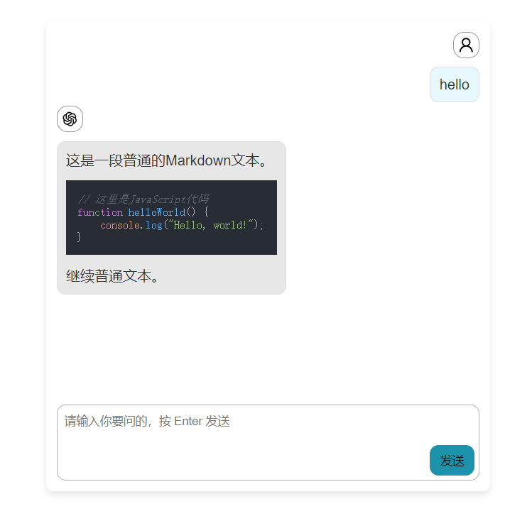

# React AI Chat Component


This is a React component for interacting with large models through chat. The component allows users to input text, send it to a large model for processing, and display the model's response. It is suitable for creating interactive chat interfaces and can be easily integrated into any React application. It is intended to be used together with the [useChat hook](https://sdk.vercel.ai/docs/reference/ai-sdk-ui/use-chat) in the [Vercel AI SDK](https://www.npmjs.com/package/ai).



## Available Languages

- [English](README.md)
- [简体中文](README.zh_CN.md)

## Features
* Pure UI component, with state and logic contained within the [useChat hook](https://sdk.vercel.ai/docs/reference/ai-sdk-ui/use-chat) in the [Vercel AI SDK](https://www.npmjs.com/package/ai)
* CSS-in-JS components made with styled-components, allowing users to easily customize all styles within the component using `styled-components` and `utils.getClassName`
* Plug-and-play design, with the ability to easily swap out an internal component using `utils.setComponent`
* Ability to insert your own components in predefined places using `utils.setSlot`

## Getting Started
### Installation
First, ensure that React and [ai](https://www.npmjs.com/package/ai) are already installed in your project. Then, add this component to your project
``` js
npm install ai-chat-react
```
Or, if you're using yarn
``` js
yarn add ai-chat-react
```

### Example Code
Below is a simple example of how to use `AIChatComponent` in your React application:
``` jsx
import React from 'react';
import AIChatComponent from 'ai-chat-react'
import { useChat } from 'ai/react';

const Index = () => {
    const chat = useChat();
    return <AIChatComponent {...chat}/>
};

export default Index;
```
Example of customizing styles using styled-component and utils/getClassName:
``` jsx
import React from 'react';
import AIChatComponent, { utils } from 'ai-chat-react'
import styled from 'styled-components';
import { useChat } from 'ai/react';

const ChatContainer = styled.div`
    .${utils.getClassName('SendButton')} {
        color: red;
    }
`
const Index = () => {
    const chat = useChat();
    return <ChatContainer>
        <AIChatComponent {...chat}/>
    </ChatContainer>
};

export default Index;
```

Example of replacing an internal component using utils/setComponent:
``` jsx
import React from 'react';
import AIChatComponent, {utils} from 'ai-chat-react'
import { useChat } from 'ai/react';
utils.setComponent('Avatar', () => <span>A</span>)

const Index = () => {
    const chat = useChat();
    return <AIChatComponent {...chat}/>
};

export default Index;
```

Example of adding functionality using utils/setSlot:
``` jsx
import React from 'react';
import AIChatComponent, {utils} from 'ai-chat-react'
import { useChat } from 'ai/react';
utils.setSlot('BetweenMessageBoxAndChatInputBox', ({isLoading}) => isLoading ? (<span>loading...</span>)) : null

const Index = () => {
    const chat = useChat();
    return <AIChatComponent {...chat}/>
};

export default Index;
```

Example in Next.js:
``` jsx
import React, { memo } from 'react';
import dynamic from 'next/dynamic';
import styled from 'styled-components';
import { useChat } from 'ai/react';

// Since it's rendered asynchronously, use utils functionality also in dynamic, using utils getClassname functionality outside will not get the corresponding classname due to not being rendered yet
const ChatgptComponent = dynamic(() => import("ai-chat-react").then(C => {
  C.utils.setSlot('BetweenMessageBoxAndChatInputBox', () => (<span style={{ color: 'black' }}>BetweenMessageBoxAndChatInputBox</span>));
  const ModalContent = styled.div`
    position: fixed;
    right: 70px;
    bottom: 50px;
    background-color: #fff;
    padding: 20px 10px 30px 10px;
    border-radius: 5px;
    box-shadow: 0 4px 6px rgba(0, 0, 0, 0.1);
    z-index: 1001;
    width: 500px;
    height: calc(100vh - 100px);
    .${C.utils.getClassName('AvatarContainer')} {
        color: #333;
    }
`;
const ModalContentTitle = styled.div`
  color: #333;
  padding-bottom: 4px;
  margin-bottom: 4px;
  border-bottom: 1px solid #d6d5d5;
  font-weight: bold;
`;
  return ({...chat}: React.ComponentProps<typeof C.default>) => (
    <ModalContent>
        <ModalContentTitle>Chat with qianjie</ModalContentTitle>
        {typeof document !== "undefined" && (
          <C.default {...chat}/>
        )}
    </ModalContent>
  );
}), {ssr: false});
const MemoChatgptComponent = memo(ChatgptComponent);

const Index = () => {
    const chat = useChat();
    return <MemoChatgptComponent {...chat}/>
};

export default Index;
```

### Configuration Options
The `AIChatComponent` component accepts the following props for configuration:

From useChat:
* `messages` (from useChat)
* `error` (from useChat)
* `input` (from useChat)
* `handleInputChange` (from useChat)
* `handleSubmit` (from useChat)
* `isLoading` (from useChat)

Internal component properties:
* `MeAvatar` (React.ReactElement)
* `GptAvatar` (React.ReactElement)
* `sendText` (React.ReactElement)

### Contributing
We welcome all forms of contributions, whether it's feature requests, bug reports, or pull requests. Please ensure your code follows the project's coding standards.

### License
This project is licensed under the MIT License. For more information, please see the LICENSE file.